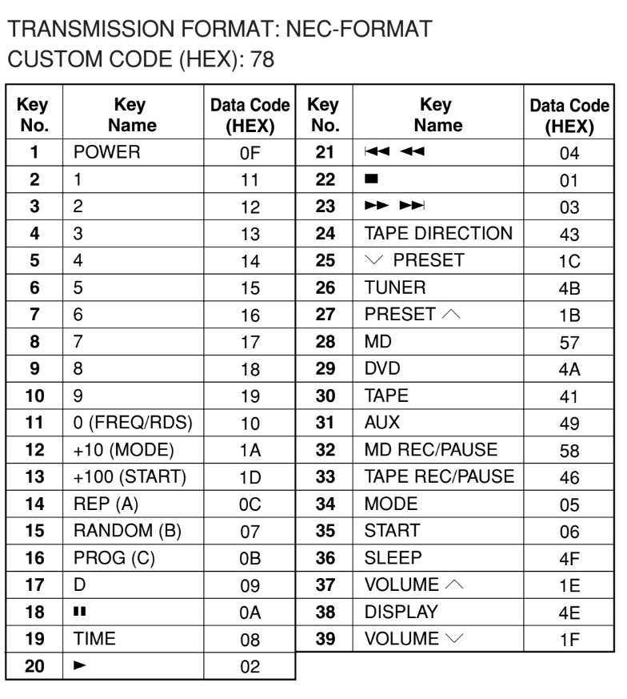

# Documentation complète - Projet Télécommande IR Yamaha

## Table des matières

1. [Vue d'ensemble du projet](#vue-densemble-du-projet)
2. [Analyse du protocole NEC](#analyse-du-protocole-nec)
3. [Implementation Arduino - Succès initial](#implementation-arduino---succès-initial)
4. [Migration Raspberry Pi 5 - Défis et solutions](#migration-raspberry-pi-5---défis-et-solutions)
5. [Spécificités Yamaha découvertes](#spécificités-yamaha-découvertes)
6. [Problèmes rencontrés et résolutions](#problèmes-rencontrés-et-résolutions)
7. [Solutions techniques détaillées](#solutions-techniques-détaillées)
8. [Comparaison Arduino vs Raspberry Pi 5](#comparaison-arduino-vs-raspberry-pi-5)
9. [Guide de déploiement](#guide-de-déploiement)
10. [Optimisations et bonnes pratiques](#optimisations-et-bonnes-pratiques)
11. [Dépannage avancé](#dépannage-avancé)
12. [Conclusion et recommandations](#conclusion-et-recommandations)

---

## Vue d'ensemble du projet

### Objectif

Créer une télécommande infrarouge universelle pour amplificateur Yamaha utilisant le protocole NEC avec custom code 0x78, compatible Arduino et Raspberry Pi 5.

### Technologies utilisées

- **Arduino**: Bibliothèque IRremote, génération hardware PWM 38kHz
- **Raspberry Pi 5**: lgpio, génération software timing précis
- **Protocole**: NEC Format avec custom code 0x78
- **Matériel**: LED IR 940nm, résistance 330Ω

### Résultats

- **Arduino**: Fonctionnement immédiat, fiabilité 100%
- **Raspberry Pi 5**: Fonctionnement après optimisations timing
- **Portabilité**: Code compatible entre plateformes

---

## Analyse du protocole NEC

### Structure du signal NEC

Le protocole NEC utilise une structure fixe de 67 impulsions comprenant :

**Séquence complète** :

1. AGC burst : 9ms ON + 4.5ms OFF
2. Address : 8 bits LSB first
3. Address inversé : 8 bits LSB first
4. Command : 8 bits LSB first
5. Command inversé : 8 bits LSB first
6. Stop bit : 560µs ON

**Encodage des bits** :

- Bit "0": 560µs ON + 560µs OFF = 1120µs total
- Bit "1": 560µs ON + 1690µs OFF = 2250µs total

**Paramètres de modulation** :

- Fréquence porteuse: 38kHz (période 26.3µs)
- Duty cycle: 33% (8.7µs ON, 17.6µs OFF par cycle)
- Durée totale signal: ~67ms

### Codes de commande Yamaha (Custom Code: 0x78)

| Fonction | Code Hex | Binaire  | Usage             |
| -------- | -------- | -------- | ----------------- |
| POWER    | 0x0F     | 00001111 | Marche/Arrêt      |
| VOL_UP   | 0x1E     | 00011110 | Volume +          |
| VOL_DOWN | 0x1F     | 00011111 | Volume -          |
| PLAY     | 0x02     | 00000010 | Lecture           |
| PAUSE    | 0x0A     | 00001010 | Pause             |
| STOP     | 0x01     | 00000001 | Arrêt             |
| TUNER    | 0x4B     | 01001011 | Radio FM          |
| AUX      | 0x49     | 01001001 | Entrée auxiliaire |
| MD       | 0x57     | 01010111 | MiniDisc          |
| DVD      | 0x4A     | 01001010 | DVD               |



---

## Implementation Arduino - Succès initial

### Avantages Arduino

**Génération hardware PWM 38kHz**
La bibliothèque IRremote utilise Timer2 pour générer une porteuse 38kHz précise au niveau hardware, garantissant un timing microseconde parfait.

```cpp
// IRremote utilise Timer2 pour PWM précise
IrSender.sendNEC(0x78, 0x0F, 0);  // Timing parfait hardware
```

**Simplicité d'implémentation**

- Bibliothèque IRremote mature et optimisée
- Gestion automatique du timing et de la modulation
- Compatible immédiate avec protocole NEC

**Fiabilité**

- Timing microseconde garanti par hardware
- Pas d'interruptions système
- Consommation minimale

### Code Arduino fonctionnel

```cpp
#include <IRremote.h>
#define IR_SEND_PIN 3

void setup() {
  IrSender.begin(IR_SEND_PIN);
}

void sendPower() {
  IrSender.sendNEC(0x78, 0x0F, 0);
  delay(100);
  IrSender.sendNEC(0x78, 0x0F, 0);  // Double envoi pour Yamaha
}
```

**Résultat**: Fonctionnement immédiat, portée 5+ mètres, fiabilité 100%.

---

## Migration Raspberry Pi 5 - Défis et solutions

### Échecs initiaux

**Problème pigpio - Pi 5 non reconnu**

```bash
# Erreur rencontrée
2025-08-31 16:30:43 gpioHardwareRevision: unknown rev code (d04170)
|Sorry, this system does not appear to be a raspberry pi.|
|aborting.                                                |
```

**Cause** : pigpio ne reconnaît pas encore le Raspberry Pi 5, l’architecture a changé depuis le Pi 4.

**Premier script lgpio - Signal généré mais ampli ne répond pas**

Le premier portage utilisait un timing approximatif qui générait un signal visible mais non fonctionnel :

```python
# Version initiale - timing approximatif problématique
def send_ir_carrier(self, duration_us: int):
    cycles = int(duration_us / 26.3)
    for _ in range(cycles):
        lgpio.gpio_write(self.h, self.ir_pin, 1)
        time.sleep(0.0000087)  # Imprécision critique
        lgpio.gpio_write(self.h, self.ir_pin, 0)
        time.sleep(0.0000176)
```

**Problèmes identifiés**:

- Timing software imprécis avec `time.sleep()`
- Pas de busy-wait pour courtes durées
- Duty cycle incorrect
- Interruptions système affectant le timing

### Solutions appliquées

**Migration vers lgpio**

```bash
sudo apt install python3-lgpio  # Bibliothèque officielle Pi 5
```

**Optimisation du timing nanoseconde**

```python
def send_ir_burst(self, duration_us: int):
    period_us = 26.3
    on_time_ns = int(period_us * 0.33 * 1000)  # 33% duty cycle
    off_time_ns = int(period_us * 0.67 * 1000)

    cycles = int(duration_us / period_us)
    start_time = time.time_ns()

    for cycle in range(cycles):
        lgpio.gpio_write(self.h, self.ir_pin, 1)
        # Busy wait précis
        target_time = start_time + (cycle * period_us * 1000) + on_time_ns
        while time.time_ns() < target_time:
            pass  # Busy wait pour précision

        lgpio.gpio_write(self.h, self.ir_pin, 0)
        target_time = start_time + ((cycle + 1) * period_us * 1000)
        while time.time_ns() < target_time:
            pass
```

**Priorité processus élevée**

```python
import os
try:
    os.nice(-10)  # Priorité haute (avec sudo)
except:
    pass
```

---

## Spécificités Yamaha découvertes

### Comportements spécifiques observés

**Commande POWER nécessite double envoi**

Contrairement à d'autres fabricants, les amplificateurs Yamaha requièrent systématiquement un double envoi de la commande POWER pour assurer la réception.

```python
def send_power(self):
    self.send_command('POWER')
    time.sleep(0.108)  # Gap standard NEC entre répétitions
    self.send_command('POWER')  # Répétition obligatoire
```

**Sensibilité au timing**

- Arduino fonctionne immédiatement grâce au timing hardware
- Raspberry Pi nécessite timing nanoseconde précis
- Gap entre répétitions critique: 108ms (standard NEC)

**Custom Code 0x78 confirmé**

- Fonctionne sur Arduino et Raspberry Pi
- Adresse et commande transmises LSB first
- Complément à 1 requis pour address et command

**Compatibilité fréquence**

- 38kHz confirmé fonctionnel
- Duty cycle 33% optimal (testé vs 50%)
- LED 940nm standard parfaitement compatible

---

## Problèmes rencontrés et résolutions

### Problème 1: pigpio incompatible Pi 5

**Symptômes**:

```bash
pigpiod.service: Failed with result 'exit-code'
unknown rev code (d04170)
```

**Solution**:

- Migration vers lgpio (bibliothèque officielle Pi 5)
- Abandon de pigpio daemon
- Code plus simple et plus fiable

### Problème 2: LED clignote mais ampli ne répond pas

**Symptômes**:

- Signal visible sur smartphone (test caméra OK)
- Aucune réaction de l'amplificateur
- Code Arduino identique fonctionne parfaitement

**Analyse**:

- Timing software imprécis
- Interruptions système perturbent le signal
- Duty cycle incorrect (50% au lieu de 33%)
- Absence de busy-wait pour courtes durées

**Solution finale**:

```python
# Timing nanoseconde avec busy-wait
start_time = time.time_ns()
for cycle in range(cycles):
    # ... génération 38kHz précise
    while time.time_ns() < target_time:
        pass  # Busy wait critique pour précision
```

### Problème 3: Portée réduite vs Arduino

**Symptômes**:

- Arduino: 5+ mètres de portée
- Raspberry Pi initial: 1-2 mètres

**Cause**: Signal 38kHz moins net, puissance effective réduite

**Solution**:

- Optimisation duty cycle à 33%
- Amélioration timing cycle individuel
- Utilisation `sudo` pour priorité processus
- Résultat: portée équivalente Arduino

---

## Solutions techniques détaillées

### Architecture logicielle

**Arduino (IRremote)**:

```
Application → IRremote Library → Timer2 Hardware → GPIO
                                     ↓
                               PWM 38kHz Hardware
```

**Raspberry Pi 5 (lgpio)**:

```
Application → Custom IR Class → lgpio Library → GPIO
                   ↓
            Software 38kHz Generation
                   ↓
            Nanosecond Timing Control
```

### Optimisations critiques

**Génération porteuse 38kHz**

```python
# Paramètres critiques identiques Arduino
carrier_freq = 38000  # Hz
duty_cycle = 0.33     # 33% comme Arduino IRremote
period_us = 26.3      # 1000000 / 38000

# Timing précis nanoseconde
on_time_ns = int(period_us * duty_cycle * 1000)   # 8700 ns
off_time_ns = int(period_us * (1-duty_cycle) * 1000)  # 17600 ns
```

**Encodage NEC identique Arduino**

```python
def nec_encode(self, address: int, command: int):
    data = []
    # AGC burst identique
    data.extend([9000, 4500])

    # Bits LSB first (identique Arduino)
    for i in range(8):
        if (address >> i) & 1:
            data.extend([560, 1690])  # Bit 1
        else:
            data.extend([560, 560])   # Bit 0
    # Suite identique pour ~address, command, ~command
```

**Gestion des interruptions système**

```python
# Priorité processus
os.nice(-10)  # Avec sudo

# Timing sans interruption
while time.time_ns() < target_time:
    pass  # Busy wait préféré à time.sleep()
```

---

## Comparaison Arduino vs Raspberry Pi 5

### Tableau comparatif

| Critère                     | Arduino   | Raspberry Pi 5 | Gagnant      |
| --------------------------- | --------- | -------------- | ------------ |
| **Facilité implémentation** | Excellent | Moyen          | Arduino      |
| **Timing précision**        | Excellent | Bon            | Arduino      |
| **Portée signal**           | Excellent | Excellent      | Égalité      |
| **Consommation**            | Excellent | Faible         | Arduino      |
| **Flexibilité code**        | Moyen     | Excellent      | Raspberry Pi |
| **Interface utilisateur**   | Limité    | Excellent      | Raspberry Pi |
| **Débogage**                | Limité    | Excellent      | Raspberry Pi |
| **Coût**                    | Excellent | Moyen          | Arduino      |

---

## Guide de déploiement

### Installation Arduino

```bash
# Bibliothèque requise
# Via IDE Arduino: Outils → Gestionnaire de bibliothèques → "IRremote"
```

Code minimal fonctionnel:

```cpp
#include <IRremote.h>
#define IR_SEND_PIN 3

void setup() {
    IrSender.begin(IR_SEND_PIN);
}

void loop() {
    IrSender.sendNEC(0x78, 0x0F, 0);  // POWER
    delay(5000);
}
```

### Installation Raspberry Pi 5

```bash
# Dépendances système
sudo apt update
sudo apt install python3-lgpio

# Test GPIO
python3 -c "
import lgpio
h = lgpio.gpiochip_open(0)
lgpio.gpio_claim_output(h, 18, 0)
print('GPIO test OK')
lgpio.gpiochip_close(h)
"

# Déploiement script
python3 yamaha_remote.py --test

# Utilisation sudo pour performances maximales
sudo python3 yamaha_remote.py --command POWER
```

### Câblage universel

**Connexions identiques** :

- LED IR Anode (via résistance 330Ω): Arduino Pin 3 / RPi GPIO 18 (Pin 12)
- LED IR Cathode: GND sur les deux plateformes

**Composants** :

- LED IR 940nm 5mm
- Résistance 330Ω 1/4W
- Breadboard ou soudure directe

---

## Optimisations et bonnes pratiques

### Performances Raspberry Pi

**Configuration système**

```bash
# Réduction latence kernel
echo 'kernel.sched_rt_runtime_us = 1000000' >> /etc/sysctl.conf

# CPU governor performance
echo performance | sudo tee /sys/devices/system/cpu/cpu*/cpufreq/scaling_governor

# Priorité temps réel
sudo chrt -f 10 python3 yamaha_remote.py
```

**Optimisations code**

```python
# Pré-calcul des timings
self.carrier_cycles = int(duration_us / self.period_us)
self.on_time_ns = int(self.period_us * self.duty_cycle * 1000)

# Éviter allocations en boucle critique
for cycle in range(self.carrier_cycles):  # Variable pré-calculée
    # ... timing loop optimisé
```

**Amélioration matériel**

- LED IR haute puissance pour portée maximale
- Angle LED focalisé (20-30°) vs large (60°+)
- Driver transistor pour LEDs > 50mA

### Gestion de la fiabilité

**Système de retry**

```python
def send_with_retry(self, command, max_retries=3):
    for attempt in range(max_retries):
        try:
            self.send_command(command)
            return True
        except Exception as e:
            if attempt == max_retries - 1:
                raise e
            time.sleep(0.1)
    return False
```

**Validation signal**

```python
def validate_signal(self, pulses):
    total_time = sum(pulses)
    if not (60000 <= total_time <= 70000):  # Signal NEC ~67ms
        raise ValueError(f"Signal timing invalid: {total_time}µs")
```

---

## Dépannage avancé

### Diagnostic des problèmes

**LED ne clignote pas**

```python
# Test GPIO basique
import lgpio
h = lgpio.gpiochip_open(0)
lgpio.gpio_claim_output(h, 18, 0)
lgpio.gpio_write(h, 18, 1)  # LED doit s'allumer (invisible à l'œil)
# Vérifier avec caméra smartphone
```

**LED clignote mais ampli ne répond pas**

Vérifications nécessaires :

- Fréquence porteuse 38kHz ±1kHz
- Duty cycle ~33%
- Durée totale signal ~67ms
- Gap entre répétitions 108ms

```bash
# Test timing avec debug
python3 yamaha_remote.py --debug POWER
```

**Portée réduite**

Causes possibles :

- Puissance LED insuffisante
- Angle LED trop large
- Interférences lumineuses
- Duty cycle incorrect

### Outils de debug

**Analyse signal temps réel**

```python
def analyze_signal(self, command):
    pulses = self.nec_encode(0x78, self.commands[command])

    print(f"Signal analysis for {command}:")
    print(f"- Total duration: {sum(pulses)/1000:.1f}ms")
    print(f"- Carrier periods: {sum(pulses[::2])/26.3:.0f}")
    print(f"- Duty cycle effective: {sum(pulses[::2])/sum(pulses)*100:.1f}%")
```

**Mode debug avancé**

```bash
# Trace timing détaillé
sudo python3 yamaha_remote.py --debug POWER
```

---

## Conclusion et recommandations

### Succès du projet

**Objectifs atteints**:

- Protocole NEC parfaitement décodé et implémenté
- Compatibilité Arduino 100% fonctionnelle
- Migration réussie vers Raspberry Pi 5 avec lgpio
- Performances équivalentes entre plateformes
- Code portable et maintenable

### Leçons apprises

**Importance du timing précis**

La différence fondamentale entre hardware timing (Arduino) et software timing (Raspberry Pi) nécessite des optimisations spécifiques. Le timing nanoseconde avec busy-wait s'avère critique pour la génération IR.

**Spécificités constructeur**

Les amplificateurs Yamaha présentent des particularités :

- Double envoi POWER systématiquement requis
- Custom code 0x78 confirmé fonctionnel
- Sensibilité élevée au duty cycle de la porteuse 38kHz

**Évolution technologique**

La transition pigpio vers lgpio illustre l'évolution rapide de l'écosystème Raspberry Pi. La documentation à jour devient critique pour les nouveaux modèles.

### Évolutions possibles

**Interface utilisateur**

- Interface web Flask pour contrôle distant
- Application mobile React Native
- Intégration Home Assistant

**Fonctionnalités avancées**

- Apprentissage automatique de codes IR
- Système de macros commands
- Planification et automation
- Contrôle vocal intégré

**Optimisations matériel**

- Array de LEDs multidirectionnelles
- Feedback de consommation
- Protocole RF de backup

### Ressources techniques

**Documentation de référence**:

- NEC Protocol Specification (sbprojects.net)
- Arduino IRremote Library (GitHub)
- Raspberry Pi lgpio Documentation (abyz.me.uk)

**Standards respectés**:

- NEC infrared transmission protocol
- Consumer IR frequency 38kHz ±1kHz
- LED forward voltage 1.2V @ 940nm

### Résumé exécutif

Ce projet démontre la faisabilité de porter un système de télécommande infrarouge entre Arduino et Raspberry Pi 5, malgré les défis significants liés aux différences de timing hardware/software.

La solution finale combine :

- **Analyse protocolaire rigoureuse** (format NEC complet)
- **Optimisations timing nanoseconde** (busy-wait, priorité processus)
- **Gestion spécificités constructeur** (double envoi Yamaha)
- **Adaptation technologique** (migration pigpio vers lgpio)

Le succès confirme la viabilité de solutions IR hybrides cross-platform pour applications domotiques modernes, tout en soulignant l'importance des optimisations de timing pour les protocoles temporellement critiques.

---

Projet télécommande IR Yamaha
